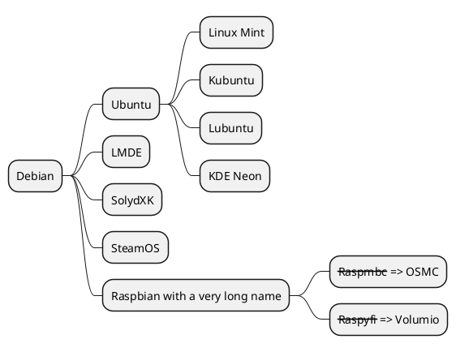

<!---md
---
date: 2021-11-19:50:19-03:00
title: "Simple Mindmap Diagram.md"
title: "Mindmap Diagram.md"
description: "Some sample examples of MindMap diagrams in Markdown"
hide_feedback: false
weight: 01
---
md--->
# PlantUML demo

> *"PlantUML in a nutshell. PlantUML is a component that allows to quickly write: Sequence diagram. Usecase diagram. Class diagram. Object diagram. Activity diagram (here is the legacy syntax) Component diagram. Deployment diagram"* - [PlantUML.com](http://PlantUML.com).

## Getting started

### MindMap Diagram

- Mindmap OrgMode syntax

