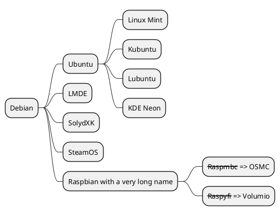

<!---md
---
date: 2021-11-19:50:19-03:00
title: "Samples Diagrams.md"
description: "Some sample examples of UML/C4Model/MindMap diagrams in Markdown"
hide_feedback: false
weight: 10
---
md--->
# PlantUML demo

> *"PlantUML in a nutshell. PlantUML is a component that allows to quickly write: Sequence diagram. Usecase diagram. Class diagram. Object diagram. Activity diagram (here is the legacy syntax) Component diagram. Deployment diagram"* - [PlantUML.com](http://PlantUML.com).

## Getting started

### Sequence Diagram

```plantuml

Alice -> Bob: Authentication Request
Bob --> Alice: Authentication Response

Alice -> Bob: Another authentication Request
Alice <-- Bob: Another authentication Response

```

- Declaring participant

```plantuml
actor Bob #red
' The only difference between actor
'and participant is the drawing
participant Alice
participant "I have a really\nlong name" as L #99FF99
/' You can also declare:
   participant L as "I have a really\nlong name"  #99FF99
  '/

Alice->Bob: Authentication Request
Bob->Alice: Authentication Response
Bob->L: Log transaction
```

### MindMap Diagram

- Mindmap OrgMode syntax


